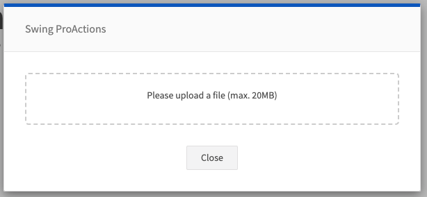

# FILE_UPLOAD

Opens a file upload dialog (modal) and stores selected file(s) into the flow context. Supports output mapping via the `outputs` config or default file output.

## Images


## At a glance
- **Category** UI
- **Aliases** USER_FILE_UPLOAD
- **Version:** 1.0.0
- **Applications:** all
- **Scope:** all

## Config Options
| Name | Description | Default | Required | Resolved | Constraints | Conditional Rules |
|---|---|:---:|:---:|:---:|---|---|
| `promptText` | Prompt text shown in the upload dialog. | None |false| true |None|None|
| `accept` | Comma-separated list of accepted MIME types for upload (e.g. "image/png,application/pdf"). | None |false| false |None|None|
| `fileTypes` | Array of accepted MIME types for the upload (e.g. ["audio/mp3","audio/wav"]). | None |false| false |None|None|
| `maxSize` | Maximum file size allowed in bytes. | None |false| false |None|None|

## Outputs
| Type | Description | Optional |
|---|---|:---:|
| `file` | Default output: the uploaded File object (when no explicit outputs are configured). | false |
| `text` | If configured, file content can be read and stored as text in the configured output name. | true |
| `arrayBuffer` | If configured, file content can be read as an ArrayBuffer into the configured output name. | true |

## Examples

### Upload a single file (default behavior)
```yaml
- step: FILE_UPLOAD
  promptText: "Please upload your document"
```

### Upload and map outputs
```yaml
- step: FILE_UPLOAD
  promptText: "Upload an audio file"
  outputs:
    - type: file
      name: uploadedFile
    - type: text
      name: fileText
```

## See Also

**General Resources:**

- [Step Library Overview](../overview.md)
- [Configuration Basics](../../guides/configuration/basics.md)
- [Examples](../../guides/examples/headline-suggestions.md)
