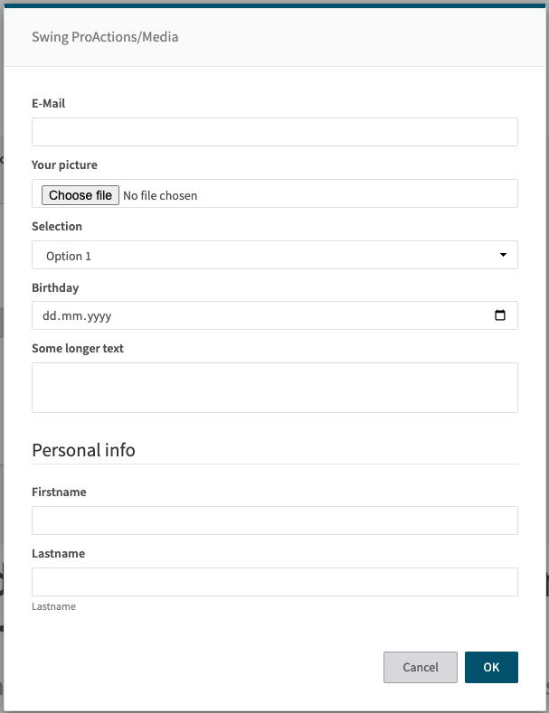

# FORM

Displays a configurable form to the user (via FormBuilder). The form definition is provided in `cfg.form`. When submitted, the returned values are merged into the flowContext.

## Images


## At a glance
- **Category** UI
- **Version:** 1.0.2
- **Applications:** all
- **Scope:** all

## When to Use


Use **FORM** when you need to collect structured input from users with validation and rich UI components.

**Use FORM when:**
- You need to collect multiple related inputs at once (name, email, options, etc.)
- You want rich input types (date pickers, dropdowns, checkboxes, text areas, diff viewers)
- You need input validation (required fields, patterns, min/max values)
- You want to show AI results for user review (diff viewer, approval checkbox)
- You need grouped or complex form layouts

**Don't use FORM when:**
- You only need a single simple text input - use **PROMPT** instead (much simpler)
- You don't need user interaction - use **SET** for programmatic variable assignment
- You need file selection - use **FILE_UPLOAD** for file picker UI

**Alternatives:**
- **PROMPT** - Simple single-line text input (use for quick, simple inputs)
- **FILE_UPLOAD** - File selection with upload functionality
- **USER_SELECT** - Selection from a list of predefined options
- **SET** - Direct variable assignment without user interaction
  

## Prerequisites

**Required Context:**
- Form fields can reference flowContext variables for default values using \{\{ \}\} syntax
- Pre-populate fields by setting flowContext variables before FORM step

**Platform Requirements:**
- Works on all platforms with UI support (Swing, Prime)
- Requires modal dialog support

## Data Flow


**Input Sources:**
1. \`cfg.form\` - Form field definitions (type, label, default, validation, etc.)
2. \`cfg.title\` - Modal title text
3. \`cfg.formConfig\` - Modal configuration (size, styling, typography)
4. \`cfg.buttons\` - Custom button configurations
5. \`cfg.inlineSteps\` - Optional steps to run before showing form (with loading UI)
6. \`flowContext.*\` - Variables used in field default values or diff viewers

**Processing Flow:**
1. Executes \`inlineSteps\` if provided (shows loading spinner)
2. Resolves templates in form field definitions
3. Builds HTML form from configuration using FormBuilder
4. Shows modal dialog with form to user
5. Waits for user to fill out and submit form
6. Validates form inputs against defined rules
7. If validation passes, extracts form values
8. Merges all form values directly into flowContext

**Output Destinations:**
- Each form field name becomes a flowContext variable
- Example: Form field "userName" → \`flowContext.userName\`
- Button clicks can set additional flowContext variables via \`flowAttribute\`
- No default text output - all values go to named flowContext properties
  

## Config Options
| Name | Description | Default | Required | Resolved | Constraints | Conditional Rules |
|---|---|:---:|:---:|:---:|---|---|
| `title` | Title of the form modal. | None |false| false |None|None|
| `form` | Form field definitions. Each key is the field name, and the value is a FormComponent object defining the field type and properties. See the comprehensive form documentation for all available field types and properties. | None |true| false |None|None|
| `buttons` | Optional buttons configuration for the form modal. Array of button objects defining submit/cancel buttons. | None |false| false |Items:1-10|None|
| `formConfig` | Optional modal-level configuration (width, height, fullScreen, typography). See FormModalConfig for all options. | None |false| true |None|None|
| `inlineSteps` | Optional steps to execute before showing the form while an in-place loading UI is shown. | None |false| false |None|None|

### `form` Object Structure

Form field definitions. Each key is the field name, and the value is a FormComponent object defining the field type and properties. See the comprehensive form documentation for all available field types and properties.

**Dynamic Properties:**

This object accepts dynamic keys. Each key-value pair should follow this structure:
- **Key**: Any string (field name)
- **Value**: One of the following types:
  - External schema reference → `partial-step.form.schema.json#/definitions/formComponent`
  - External schema reference → `partial-step.form.schema.json#/definitions/formGroup`
- **Description**: See the referenced schemas for complete field definitions and validation rules

### `formConfig` Object Structure

Optional modal-level configuration (width, height, fullScreen, typography). See FormModalConfig for all options.

**Fixed Properties:**

| Property | Type | Description | Required | Constraints |
|---|---|---|:---:|---|
| `dialogSize` | `string` | Bootstrap dialog size: "sm", "md", "lg", "xl" | false |None|
| `width` | `string` | Modal width (e.g., "720px", "80vw") | false |None|
| `maxWidth` | `string` | Maximum modal width | false |None|
| `height` | `string` | Modal height (e.g., "600px", "80vh") | false |None|
| `maxHeight` | `string` | Maximum modal height | false |None|
| `fullScreen` | `boolean` | Force modal to cover entire viewport | false |None|
| `bodyFontSize` | `string` | Font size for modal body | false |None|
| `bodyLineHeight` | `string` | Line height for modal body | false |None|
| `labelFontSize` | `string` | Font size for form labels | false |None|
| `inputFontSize` | `string` | Font size for form inputs | false |None|
| `inputLineHeight` | `string` | Line height for form inputs | false |None|
| `diffFontSize` | `string` | Font size for diff components | false |None|
| `diffLineHeight` | `string` | Line height for diff components | false |None|
| `modalClass` | `string` | Additional CSS class for modal | false |None|

### `buttons` Array Items Structure

Each item in the `buttons` array should be an object with the following properties:

| Property | Type | Description | Required |
|---|---|---|:---:|
| `type` | `string` (`submit`, `cancel`) | Button type | true |
| `label` | `string` | Button label text | false |
| `name` | `string` | Button name attribute (used when type is submit) | false |
| `title` | `string` | Button title attribute (tooltip) | false |
| `class` | `string` | CSS class for button styling (e.g., "btn btn-primary") | false |
| `flowAttribute` | `string` | Flow context variable name to store the button name/value when clicked | false |

## Examples

### Simple text input form
```yaml
- step: FORM
  title: "Your info"
  form:
    firstName:
      type: text
      label: "First name"
      required: true
    lastName:
      type: text
      label: "Last name"
      required: true
```

### Form with various input types
```yaml
- step: FORM
  title: "Content Settings"
  form:
    title:
      type: text
      label: "Article Title"
      placeholder: "Enter title..."
      required: true

    category:
      type: select
      label: "Category"
      options:
        - News
        - Sports
        - Business
      default: "News"

    priority:
      type: radio
      label: "Priority"
      options:
        - key: "high"
          value: "High Priority"
        - key: "normal"
          value: "Normal Priority"
        - key: "low"
          value: "Low Priority"
      default: "normal"

    publishNow:
      type: checkbox
      label: "Publish immediately"
      default: true

    publishDate:
      type: date
      label: "Publish Date"
      required: true

    summary:
      type: textarea
      label: "Summary"
      rows: 4
      placeholder: "Enter summary..."
```

### Form with diff component
```yaml
- step: SET
  originalText: "The quick brown fox"
  improvedText: "The swift brown fox jumps"

- step: FORM
  title: "Review Changes"
  form:
    changes:
      type: diff
      mode: "words"
      prevText: "{{ flowContext.originalText }}"
      text: "{{ flowContext.improvedText }}"
      showDeletions: true
      interactive: true
```

### Form with formConfig sizing
```yaml
- step: FORM
  title: "Large Review Form"
  formConfig:
    dialogSize: "xl"
    height: "80vh"
    diffFontSize: "14px"
    diffLineHeight: "1.6"
  form:
    reviewField:
      type: diff
      mode: "words"
      prevText: "{{ flowContext.original }}"
      text: "{{ flowContext.improved }}"
      interactive: true
```

### Form with custom buttons
```yaml
- step: FORM
  title: "Choose Action"
  form:
    action:
      type: select
      label: "Select action"
      options:
        - translate
        - summarize
        - improve
  buttons:
    - type: cancel
      label: "Cancel"
    - type: submit
      flowAttribute: "userAction"
      name: "proceed"
      label: "Proceed"
      class: "btn btn-primary"
```

### Form with multiple action buttons
```yaml
- step: FORM
  title: "Review Content"
  form:
    feedback:
      type: textarea
      label: "Your feedback"
      rows: 3
  buttons:
    - type: submit
      flowAttribute: "action"
      name: "approve"
      label: "Approve"
      class: "btn btn-success"
    - type: submit
      flowAttribute: "action"
      name: "revise"
      label: "Request Revision"
      class: "btn btn-warning"
    - type: submit
      flowAttribute: "action"
      name: "reject"
      label: "Reject"
      class: "btn btn-danger"
    - type: cancel
      label: "Cancel"

- step: SWITCH
  condition: "{{ flowContext.action }}"
  cases:
    "approve":
      - step: SHOW_NOTIFICATION
        message: "Content approved"
    "revise":
      - step: SHOW_NOTIFICATION
        message: "Revision requested"
    "reject":
      - step: SHOW_NOTIFICATION
        message: "Content rejected"
```

## Common Patterns

### AI Text Review Workflow

Show AI-generated improvements in diff viewer for user approval

```yaml
# Step 1: Get original text
- step: SET
  originalText: "{{ client.getTextContent() }}"

# Step 2: Generate improved version with AI
- step: HUB_COMPLETION
  instruction: "Improve this text for clarity: {{ flowContext.originalText }}"

# Step 3: Show comparison and get approval
- step: FORM
  title: "Review AI Improvements"
  form:
    comparison:
      type: diff
      prevText: "{{ flowContext.originalText }}"
      text: "{{ flowContext.text }}"
      label: "Proposed Changes"
      interactive: true
    approved:
      type: checkbox
      label: "Apply these changes"
      default: true

# Step 4: Insert if approved
- step: IF
  condition: "{{ flowContext.approved }}"
  then:
    - step: INSERT_TEXT
      in: "{{ flowContext.comparison }}"
```

### Multi-Field Data Collection

Collect structured data with validation

```yaml
- step: FORM
  title: "Article Metadata"
  form:
    title:
      type: text
      label: "Article Title"
      placeholder: "Enter title..."
      required: true
      minLength: 10
      maxLength: 200

    category:
      type: select
      label: "Category"
      options:
        - News
        - Sports
        - Business
        - Technology
      default: "News"

    priority:
      type: radio
      label: "Priority Level"
      options:
        - key: "high"
          value: "High Priority"
        - key: "normal"
          value: "Normal"
        - key: "low"
          value: "Low Priority"
      default: "normal"

  # Use collected data
  - step: SET_METADATA
  selector: "metadata > #titlefield"
  inputs:
    - type: text
      name: title
```

### Form with Inline Data Loading

Load data before showing form (e.g., fetch from API)

```yaml
title: Example Action
  flow:
    - step: FORM
      title: "Select Template"
      # These steps run BEFORE form is shown (with loading spinner)
      inlineSteps:
        - step: REST
          url: "https://api.example.com/templates"
          method: "GET"


      # Form shows after inlineSteps complete
      form:
        text:
          type: text
          label: "My value"
          required: true

        customization:
          type: textarea
          label: "Customization Notes"
```

## Common Pitfalls

:::warning Don't forget that form values overwrite flowContext variables with same names

**Why:** If a form field is named "text" and flowContext.text already exists, the form value will replace it, potentially losing important data

**Solution:** Use descriptive, unique field names that won't conflict with existing flowContext variables. Prefix form fields if needed (e.g., "form_text", "user_input").
:::

:::warning Don't use FORM for simple single-text inputs

**Why:** FORM has more overhead and complexity than PROMPT. For a single text input, PROMPT is simpler and faster.

**Solution:** Use PROMPT for single text inputs. Reserve FORM for multi-field forms or when you need specific input types (date, select, checkbox, diff).
:::

:::warning Don't forget to handle form cancellation

**Why:** Users can close the form modal without submitting, which stop the flow execution.

**Solution:** Use a submit button labeled "Cancel" to handle the cancel selection.
:::

## See Also

**Related Steps:**
- **[PROMPT](PROMPT.md)** - Simpler alternative for single text input: Use PROMPT for single text fields, FORM for multiple fields or complex input types.
- **[FILE_UPLOAD](FILE_UPLOAD.md)** - Alternative for file selection: Use FILE_UPLOAD when you need users to select/upload files, FORM for data entry.
- **[USER_SELECT](USER_SELECT.md)** - Alternative for simple selection: Use USER_SELECT for choosing from a list, FORM for collecting multiple inputs.
- **[SET](SET.md)** - Use before to pre-populate: Use SET before FORM to set default values for form fields.
- **[IF](IF.md)** - Use after to validate: Use IF after FORM to check if user submitted or cancelled, or to validate responses.

**General Resources:**

- [Step Library Overview](../overview.md)
- [Configuration Basics](../../guides/configuration/basics.md)
- [Examples](../../guides/examples/headline-suggestions.md)
