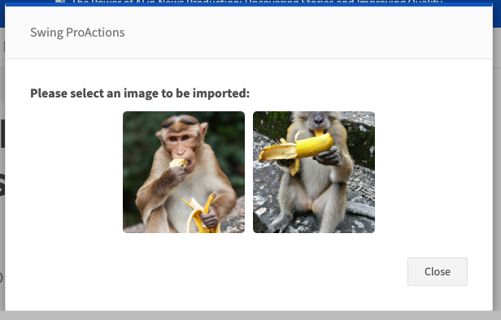

# IMAGE_PICKER

Shows an image picker modal allowing the user to pick one image from a provided list of image objects (\{ url, previewUrl?, label? \}). The selected image object is stored as an output.

## Images


## At a glance
- **Category** UI
- **Aliases** USER_IMAGE_PICKER
- **Version:** 1.0.0
- **Applications:** all
- **Scope:** all

## Config Options
| Name | Description | Default | Required | Resolved | Constraints | Conditional Rules |
|---|---|:---:|:---:|:---:|---|---|
| `promptText` | Prompt text shown in the image picker modal. | None |false| true |None|None|
| `imageList` | List of image objects to show. Each item should contain at least a `url` and optionally `previewUrl` and `label`. | None |false| false |None|None|

## Outputs
| Type | Description | Optional |
|---|---|:---:|
| `image` | Selected image object (includes url, previewUrl?, label?). | false |

## Examples

### Pick an image from an explicit list
```yaml
- step: USER_IMAGE_PICKER
  promptText: "Choose an image"
  imageList:
    - url: "https://example.com/image1.jpg"
      previewUrl: "https://example.com/thumb1.jpg"
      label: "Image 1"
    - url: "https://example.com/image2.jpg"
      previewUrl: "https://example.com/thumb2.jpg"
      label: "Image 2"
```

## See Also

**General Resources:**

- [Step Library Overview](../overview.md)
- [Configuration Basics](../../guides/configuration/basics.md)
- [Examples](../../guides/examples/headline-suggestions.md)
