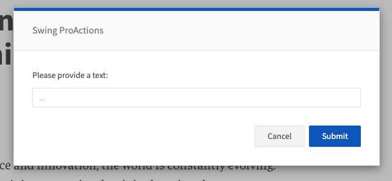

# PROMPT

Shows a simple prompt to the user and stores the entered text into the default text output.

## Images


## At a glance
- **Category** UI
- **Aliases** USER_PROMPT
- **Version:** 1.0.0
- **Applications:** all
- **Scope:** all

## Config Options
| Name | Description | Default | Required | Resolved | Constraints | Conditional Rules |
|---|---|:---:|:---:|:---:|---|---|
| `promptText` | Text displayed in the prompt. Can contain template placeholders resolved against the flowContext. | None |false| true |None|None|
| `placeholder` | Optional placeholder shown inside the input field. | None |false| false |None|None|

## Outputs
| Type | Description | Optional |
|---|---|:---:|
| `text` | The text entered by the user is written to the default text output (or the configured output variable). | false |

## Examples

### Simple prompt
```yaml
- step: PROMPT
  promptText: "Please enter your name"
```

### Provide text via SET before prompt (useful when pre-filling)
```yaml
- step: SET
  text: "Pre-filled value"

- step: PROMPT
  promptText: "Edit the pre-filled value"
```

## See Also

**General Resources:**

- [Step Library Overview](../overview.md)
- [Configuration Basics](../../guides/configuration/basics.md)
- [Examples](../../guides/examples/headline-suggestions.md)
