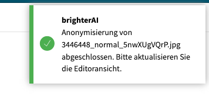

# SHOW_NOTIFICATION

Shows a notification to the user with optional title and resolved message.

## Images


## At a glance
- **Category** UI
- **Aliases** CTX_SHOW_NOTIFICATION
- **Version:** 1.0.0
- **Applications:** all
- **Scope:** all

## Config Options
| Name | Description | Default | Required | Resolved | Constraints | Conditional Rules |
|---|---|:---:|:---:|:---:|---|---|
| `notificationType` | Type of notification (info, warning, error, message, task, success). | info |false| false |None|None|
| `message` | The message to show. Supports variable resolution. | None |true| true |None|None|
| `title` | Optional title for the notification. | None |false| false |None|None|

## Examples

### Show a simple notification
```yaml
 - step: SHOW_NOTIFICATION
   notificationType: "info"
   message: "Processing completed for {{userName}}"
   title: "Done"
 ```

## See Also

**General Resources:**

- [Step Library Overview](../overview.md)
- [Configuration Basics](../../guides/configuration/basics.md)
- [Examples](../../guides/examples/headline-suggestions.md)
