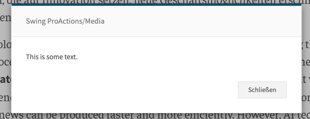

# SHOW_RESPONSE

Shows a response to the user in a modal. Can run inline steps before showing and supports HTML and Markdown modes.

## Images


## At a glance
- **Category** UI
- **Aliases** CTX_SHOW_RESPONSE
- **Version:** 1.0.0
- **Applications:** all
- **Scope:** all

## Config Options
| Name | Description | Default | Required | Resolved | Constraints | Conditional Rules |
|---|---|:---:|:---:|:---:|---|---|
| `inlineSteps` | Steps to execute while showing an in-place loading UI before the response is displayed. | None |false| false |None|None|
| `mode` | Render mode for the response. Use "html" to render HTML, "markdown" to render Markdown, or "text" for plain text. | None |false| false |None|None|

## Inputs
| Type | Description | Default | Required | Resolved |
|---|---|:---:|:---:|:---:|
| `text` | Text content to display in the modal | None | true | false |

## Examples

### Show a text response
```yaml
 - step: SET
   text: "Text to show"
 - step: SHOW_RESPONSE
 ```

### Show HTML response with inline steps
```yaml
 - step: SHOW_RESPONSE
   inlineSteps:
     - step: SET
       text: "<h2>Processing...</h2>"
   mode: "html"
 ```

### Show Markdown response
```yaml
 - step: SET
   text: |
     # Title
     This is **bold** and this is *italic*.

     - List item 1
     - List item 2
 - step: SHOW_RESPONSE
   mode: "markdown"
 ```

## See Also

**General Resources:**

- [Step Library Overview](../overview.md)
- [Configuration Basics](../../guides/configuration/basics.md)
- [Examples](../../guides/examples/headline-suggestions.md)
