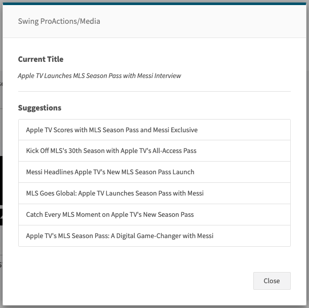

# USER_SELECT

Displays a selection modal allowing the user to pick one item from a list. The list may be provided directly or produced by a pre-processing step (inlineSteps). The selected value is written to the default text output.

## Images


## At a glance
- **Category** UI
- **Version:** 1.0.0
- **Applications:** all
- **Scope:** all

## Config Options
| Name | Description | Default | Required | Resolved | Constraints | Conditional Rules |
|---|---|:---:|:---:|:---:|---|---|
| `inlineSteps` | Optional steps to execute before showing the selection modal. Useful to prepare or transform input. | None |false| false |None|None|
| `promptText` | Prompt or title text shown at the top of the selection modal (supports variable resolution). | None |false| true |None|None|
| `infoTitle` | Optional title shown above additional info in the selection modal. | None |false| true |None|None|
| `infoText` | Optional descriptive text shown in the selection modal (supports variable resolution). | None |false| true |None|None|
| `enableKeyboardControl` | Enable keyboard navigation in the selection modal. | None |false| false |None|None|

## Inputs
| Type | Description | Default | Required | Resolved |
|---|---|:---:|:---:|:---:|
| `list` | List of options for the user to select from. If omitted, converts text input to a list automatically. | None | false | false |

## Outputs
| Type | Description | Optional |
|---|---|:---:|
| `text` | The selected option (string) stored in the default text output. | false |

## Examples

### Simple selection from a list
```yaml
- step: USER_SELECT
  promptText: "Choose an option"
  # list can be taken from prior steps or from the flowContext
```

### Selection with inline list generation
```yaml
- step: TO_LIST
  # prepare list in flowContext.list

- step: USER_SELECT
  inlineSteps:
    - step: TO_LIST
```

## See Also

**General Resources:**

- [Step Library Overview](../overview.md)
- [Configuration Basics](../../guides/configuration/basics.md)
- [Examples](../../guides/examples/headline-suggestions.md)
